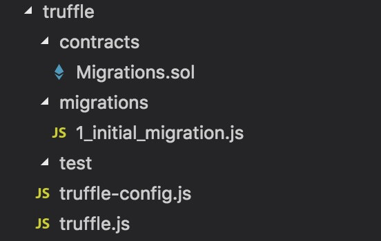
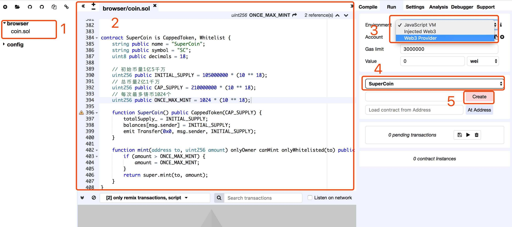
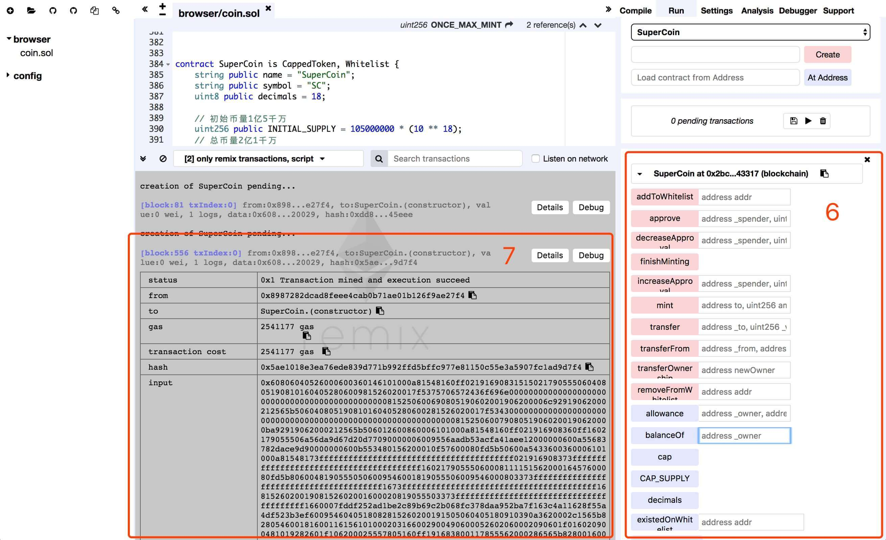
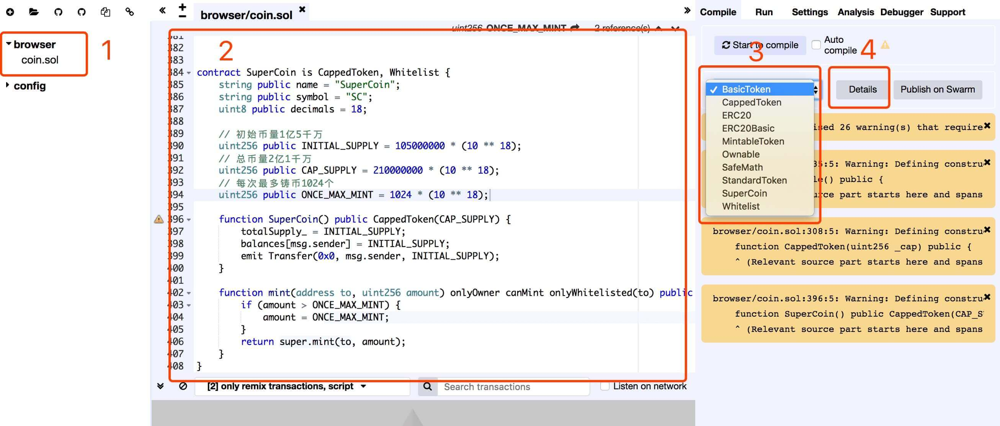
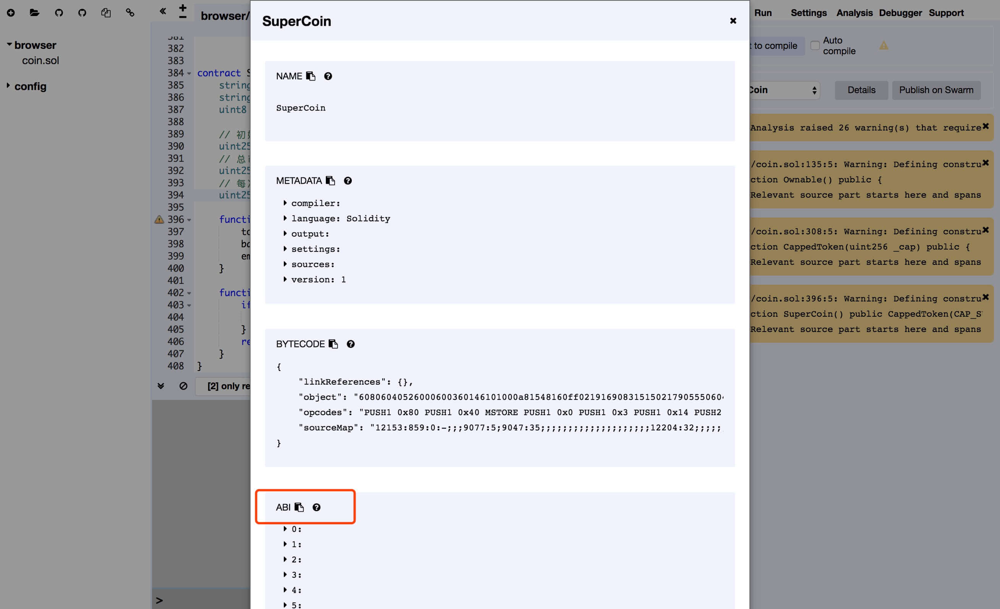

# go-connect-eth-contract

golang如何连接以太坊合约。近一段时间在学习以太坊智能合约，在学习过程中走了不少弯路，本文是对此处相关知识的总结希望可以帮助后来者少走弯路。 

## `Solidity`合约编写

通过继承[zeppelin-solidity](https://github.com/OpenZeppelin/zeppelin-solidity)提供的功能，编写一个`ERC-20`代币合约，核心代码甚至只需要定义一下代币数量和名称。  
**在实际部署合约时候，建议将所有继承到的合约都直接Copy到了源码之中**，这样做原因是Solidity目前对于import的支持还很弱，可以避免不必要到错误。在示例代码中为了便于理解，我也做了如上操作。  
下面到这个合约`SuperCoin`，主要除了定义了名称、数量之外，借助继承的合约还具备：白名单管理、铸币到白名单、铸币总量限制等功能，具体怎样实现上述功能可以自行查看源码，此处就不介绍Solidity到基础知识了。

```solidity
contract SuperCoin is CappedToken, Whitelist {
    string public name = "SuperCoin";
    string public symbol = "SC";
    uint8 public decimals = 18;

    // 初始币量1亿5千万
    uint256 public INITIAL_SUPPLY = 105000000 * (10 ** 18);
    // 总币量2亿1千万
    uint256 public CAP_SUPPLY = 210000000 * (10 ** 18);
    // 每次最多铸币1024个
    uint256 public ONCE_MAX_MINT = 1024 * (10 ** 18);

    function SuperCoin() public CappedToken(CAP_SUPPLY) {
        totalSupply_ = INITIAL_SUPPLY;
        balances[msg.sender] = INITIAL_SUPPLY;
        emit Transfer(0x0, msg.sender, INITIAL_SUPPLY);
    }

    function mint(address to, uint256 amount) onlyOwner canMint onlyWhitelisted(to) public returns (bool) {
        if (amount > ONCE_MAX_MINT) {
            amount = ONCE_MAX_MINT;
        }
        return super.mint(to, amount);
    }
}
```

### 使用`Ganache`和`Truffle`和编写和测试合约

Ganache是一个个人的以太坊客户端，可以启动一个私有链用于开发测试的区块链环境。Truffle framework是一个使用非常广泛的智能合约开发框架，通过Truffle可以快速开发和测试合约。

#### `Ganache`和`Truffle`安装

Ganache官方提供的[下载地址](http://truffleframework.com/ganache/)，下载安装允许即可不需要修改默认设置。

Truffle的目录结构跟Web项目相似度非常高，node_modules和Web一样是用来存放依赖库的目录，同样的安装依赖库也需要使用npm命令，安装方式请参考：[npmjs](https://www.npmjs.com/get-npm)

Trffule[官方](http://truffleframework.com/docs/getting_started/installation)提供的安装方式便是借助npm的：
```
npm install -g truffle
```

#### `zeppelin-solidity`安装

`zeppelin-solidity`是开发基于ERC-20代币必须要用到的库，功能比较完善，通过继承这个库的合约，可以非常方便的实现ERC-20协议、铸币、白名单等常见的功能。

```
npm install -g zeppelin-solidity
```

安装按完成后即可通过import方式引入相关依赖合约：

```
import "zeppelin-solidity/contracts/token/ERC20/CappedToken.sol";
```

#### 使用`Truffle`编写和测试合约

安装完成Truffle后，cd到目标文件夹，执行 `truffle init` 命令，程序便会生成如下图目录，需要注意的示目标文件夹必须是空文件夹：



contracts 目录存放合约文件，migrateions 目录，test 目录存放测试文件。  
初始化truffle目录后即可编写合约，详细用法可参考[官方文档](http://truffleframework.com/docs/)：
1. 在contracts文件夹下创建`SuperCoin.sol`文件，写入合约内容，solidity对于import引入方式比较糟糕，并且不同版本solidity语法还略有不同，库所使用的语法可能已经在最新版失效，建议使用过程中直接在`node_modules/zeppelin-solidity`找到对应需要继承的合约，复制到源码中进行最新版本适配和使用；
2. migrateions文件夹下创建`2_deploy_contracts.js`文件，写入合约部署配置，此步骤是固定写法，不需要修改；
3. 在部署成功后，test文件夹下创建和编写测试脚本，truffle提供了两种脚本文件类型，js文件和sol文件类型，合约运行过程中大部分都是异步操作，个人觉得js类型文件对于异步支持更好，具体测试脚本可以参考`/truffle/test`目录下提供的范例。

```
truffle compile             // 构建合约，如果构建成功可以看到新增了build文件夹
truffle migrate             // 部署合约
truffle test                // 执行目录下所有测试文件
truffle test xxx_test.js    // 测试某个test文件
```

使用`truffle migrate`不是合约的时候可能会出现`Error: No network specified. Cannot determine current network.`的错误，可以使用将下面配置测试网络的代码放到`truffle.js`文件内即可。
```
networks: {
    development: {
        host: "127.0.0.1",
        port: 7545,
        network_id: "*" // Match any network id
    }
}
```

### 使用`Geth`和`Remix`编写和测试合约

[什么是`Geth`？官方解释](https://github.com/ethereum/go-ethereum/wiki/geth)是：Geth是用Go实现的命令行界面运行的完整功能以太坊节点。借助Geth实现：在主网络挖矿、地址间转账、创建合约和发送交易、浏览区块历史等功能。我们主要需要用Geth创建合约和发送交易等功能。

#### `Geth`安装

拉取`go-ethereum`源码，建议配置命令行科学上网后再尝试：`go get -u github.com/ethereum/go-ethereum`，go-ethereum是以太坊源码，我们用Golang连接以太坊合约需要便是要借助它来实现。

Geth安装可运行命令行工具，官方分别给出来两个系统下安装包和源码两种方式：[Windows](https://github.com/ethereum/go-ethereum/wiki/Installation-instructions-for-Windows)、[Mac](https://github.com/ethereum/go-ethereum/wiki/Installation-Instructions-for-Mac)  
Mac下我推荐使用源码方式安装：
```
cd $GOPATH/src/github.com/ethereum/go-ethereum
make geth
```
执行完毕上面两个步骤，如果没有报错， build/bin/geth 便是生成好的 geth 可执行文件。  
需要注意等是源码方式安装完毕后，需要将可执行文件手动添加到环境变量。

#### 启动`Geth`客户端

正确执行上一步安装Geth，在命令行输入`geth -h`可测试geth是否正确安装，也可以通过这个命令查看geth提供的工具。

使用全默认配置启动geth客户端，在命令行输入`geth`回车执行即可，geth会默认启动一个主网络节点，并尝试连接到其他节点，开始同步全量的区块数据。

启动一个geth开发环境dev节点，这个是我们在本地使用最多的启动方式，命令如下：

>geth --networkid=1234 --nodiscover --rpc --rpcport=8545 --ws --wsport=8546 --rpccorsdomain="*" --dev --dev.period 1 --datadir=/Users/james/eth/dev console 2>>eth_dev_log

+ --networkid=1234                  ：指定网络ID，只有网络ID一致等节点才可以相互链接，以太主网路网络ID是1，不设置情况下默认ID也是1
+ --nodiscover                      ：设置为不被其他节点发现
+ --rpc --rpcport=8545              ：开启RPC连接方式，并设置端口为8545
+ --rpccorsdomain="*"               ：RPC允许所有跨域连接，这个设置主要是为了Remix在线连接本地开发网络
+ --ws --wsport=8546                ：开启WebSocket连接方式，并设置端口为8546
+ --dev --dev.period 1              ：开启开发网络无交易时自动挖矿设置，如不添加此设置在没有新交易时，默认不自动挖矿
+ --datadir=/Users/james/eth/dev    ：设置节点区块数据本地磁盘路径，不设置时将使用默认路径
+ console                           ：Geth启动后仍可接收命令行命令，如不开启又需要使用命令行也可以通过`geth attach ipc:\\.\pipe\geth.ipc`方式连接到当前节点
+ console 2>>eth_dev_log            ：将命令行操作记录输出到指定文件

启动的运行效果如下图，geth客户端运行起来后，类似于`eth.blockNumber`的方法可以在：[管理API](https://github.com/ethereum/go-ethereum/wiki/Management-APIs#list-of-management-apis)查阅：


更多参数可以使用`geth -h`方式查看。

#### `Remix`介绍

`Remix`是以太坊官方提供的在线合约构建和debug的IDE和工具集，项目地址： https://github.com/ethereum/remix-ide 、 在线工具： https://remix.ethereum.org  
下面简单介绍一下怎样用remix部署合约到前一步geth启动起来的dev环境：
1. 创建`coin.sol`文件；
2. 将编写好的合约代码置于代码区域；
3. Environment选择`Web3 Provider`，此步骤将连接本地启动的dev环境；
4. 选择我们要发布的合约`SuperCoin`；
5. 点击create按钮部署到dev环境；
6. 下图2中区域6即为合约所提供到功能，输入相关内容点击按钮即可测试合约；
7. 下图2中区域7为每一次访问dev网络的记录，点击detail查看详细，点击debug调试功能。

具体操作如下图所示：



## `Golang`连接合约

### 使用`abigen`生成合约交互工具`coin.go`

ABI是程序的二进制接口。一般来说，ABI是两个程序模块之间的接口，而且通常其中一个程序处于机器级别。也就是说事实上ABI接口就是用于将数据编码/解码到机器代码的方法。  
**在以太坊上，就是通过ABI把Solidity合约写入到EVM，后续也是借助ABI来从事务中读取到数据的。**  
具体使用的来说，需要先获取到合约abi文件，再用`abigen`工具生成`coin.go`，最后程序调用`coin.go`实现合约的部署、方法调用（白名单管理、铸币、转账、余额查询）等交互操作。

#### 生成合约abi文件

可以借助前面提到的[Remix](http://remix.ethereum.org/)工具生成abi文件。  
1. 创建`coin.sol`文件；
2. 将编写好的合约代码置于代码区域；
3. 选择我们要发布的合约`SuperCoin`；
4. 点击detail按钮；
5. 找到图2所示abi内容，复制并存储于项目中对应的`coin.abi`文件。
具体操作如下图




#### 使用`abigen`生成`coin.go`

abigen是go-ethereum一个内置工具，可以使用[下面方法安装](https://github.com/ethereum/go-ethereum/wiki/Native-DApps:-Go-bindings-to-Ethereum-contracts)

```
cd $GOPATH/src/github.com/ethereum/go-ethereum
godep go install ./cmd/abigen
```

>abigen --abi coin.abi --pkg main --type coin --out coin.go

+ --abi coin.abi    :指定abi文件来源
+ --pkg main        :指定输出文件的包名
+ --type Coin       :指定合约结构体名称
+ --out coin.go     :指定合约交互文件名称

更多使用方法可使用`abigen -h`命令来查看。

### 使用`coin.go`实现与合约交互


## 借助`Infura`连接主网络或测试网络


